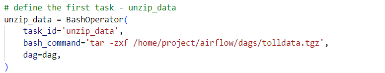
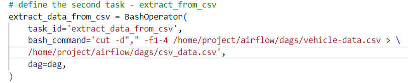
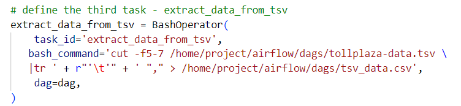
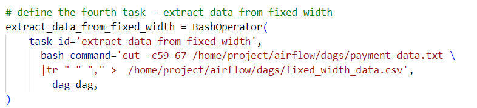
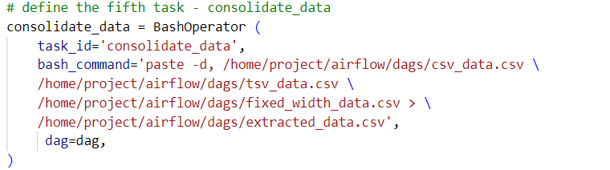
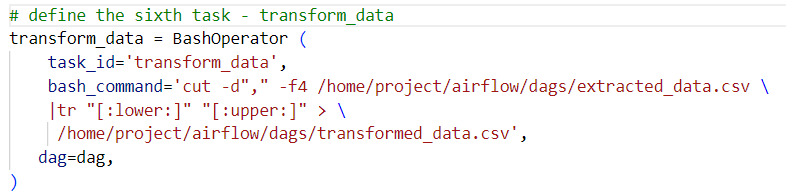
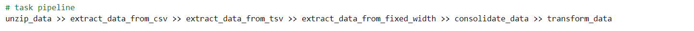

# Airflow ETL Pipeline: Toll Data

This project demonstrates an end-to-end ETL (Extract, Transform, Load) pipeline using Apache Airflow. It processes toll data from multiple flat file formats (CSV, TSV, fixed-width) and consolidates them into a unified, transformed dataset.

---

## Overview

- **Orchestrator:** Apache Airflow  
- **Pipeline Stages:** Extraction, Consolidation, Transformation  
- **Input Formats:** CSV, TSV, Fixed-width text  
- **Output:** Transformed consolidated CSV

---

## DAG Structure

The ETL process is managed by a DAG defined in [`ETL_toll_data.py`](ETL_toll_data.py). The pipeline consists of the following sequential tasks:

1. **Unzip Data**  
   Extracts raw data files from a compressed archive.  
   

2. **Extract from CSV**  
   Extracts specific fields from the vehicle data CSV.  
   

3. **Extract from TSV**  
   Extracts fields from toll plaza data in TSV format.  
   

4. **Extract from Fixed Width**  
   Parses fixed-width payment data into CSV format.  
   

5. **Consolidate Data**  
   Merges all extracted data into a single file.  
   

6. **Transform Data**  
   Applies transformations (e.g., uppercasing) to specific columns.  
   

### Task Pipeline Diagram



---

## Example DAG Code

```python
from airflow.models import DAG
from airflow.operators.bash_operator import BashOperator
from airflow.utils.dates import days_ago
from datetime import timedelta

default_args = {
    'owner': 'Lavanya',
    'start_date': days_ago(0),
    'email_on_failure': True,
    'email_on_retry': True,
    'retries': 1,
    'retry_delay': timedelta(minutes=5),
}

dag = DAG(
    dag_id='ETL_toll_data',
    default_args=default_args,
    description='Apache Airflow Final Assignment',
    schedule_interval=timedelta(days=1),
)

unzip_data = BashOperator(
    task_id='unzip_data',
    bash_command='tar -zxf /home/project/airflow/dags/tolldata.tgz',
    dag=dag,
)

# ... [Other tasks as in the code] ...
